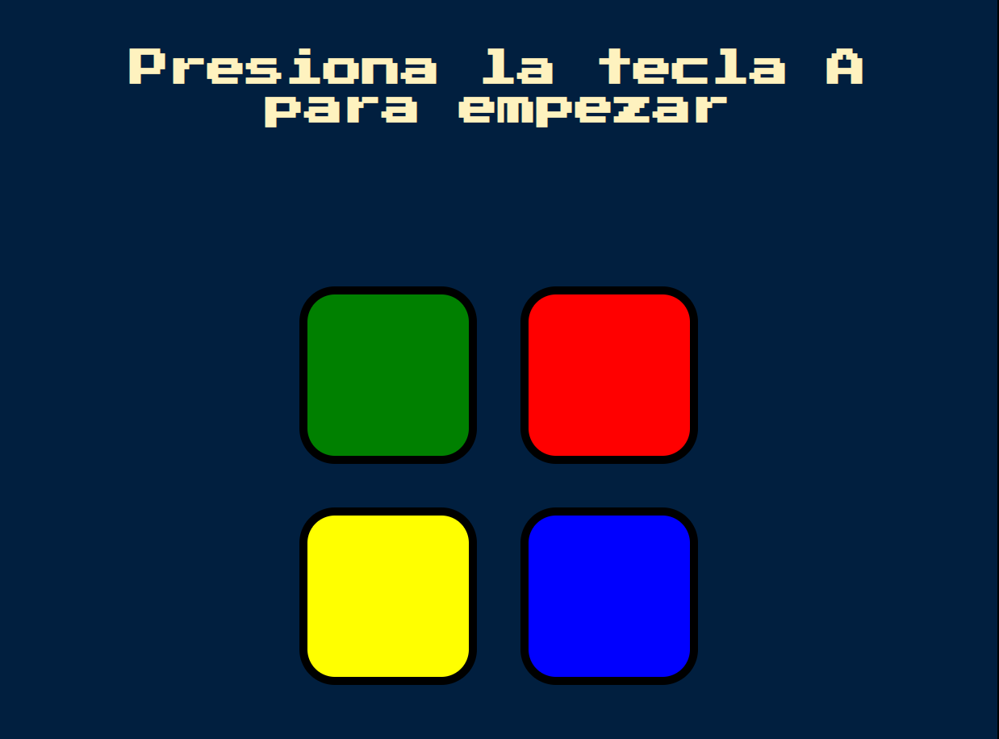

# 🟢 Simón Dice - Versión Web

Una versión interactiva del clásico juego **Simón Dice**, desarrollada con **HTML, CSS y JavaScript**.  
El objetivo es repetir correctamente la secuencia de colores generada por la computadora.  
¡Cada ronda aumenta la dificultad!

---

## 🎮 Cómo Jugar

1. Presiona cualquier tecla para comenzar el juego.
2. Observa la secuencia de colores (se encenderán uno por uno).
3. Haz clic en los botones de colores para repetir la secuencia.
4. Si te equivocas, el juego termina y puedes volver a empezar.

---

## 🧠 Lógica del Juego

- Cada nivel agrega un nuevo color a la secuencia.
- El usuario debe repetir la secuencia exactamente en el mismo orden.
- Si el usuario comete un error, se muestra un mensaje de fallo.
- Si acierta toda la secuencia, se avanza automáticamente al siguiente nivel.

---

## 🚀 Tecnologías Usadas

- HTML5
- CSS3
- JavaScript (vanilla)
- jQuery (para facilitar la manipulación del DOM)

---

---

## 📸 Vista Previa



---

## 🛠️ Instalación Local

1. Clona este repositorio:
   ```bash
   git clone https://github.com/Juda-Tech-Green/simon-dice
   cd Simon-Dice
    ```
## 🎯 ¿Por qué hice esta app?
Creé esta versión del juego Simón Dice como una forma divertida de poner en práctica conceptos clave de JavaScript como:

- Manipulación del DOM con jQuery

- Manejo de eventos (click, keydown)

- Arrays y lógica de comparación de secuencias

- Temporizadores y funciones asincrónicas (setTimeout, Promise, async/await)

- Organización de código en funciones reutilizables

Además, quería desarrollar algo visual y dinámico que me motivara a seguir aprendiendo sobre desarrollo web, ¡y qué mejor que un juego clásico con luces y sonidos! 🔴🟢🟡🔵

## 📜 Licencia
MIT © [JuDa](https://github.com/Juda-Tech-Green)
Heco con 💚 & JavaScript

